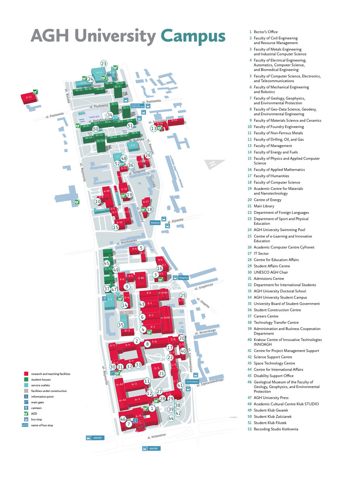
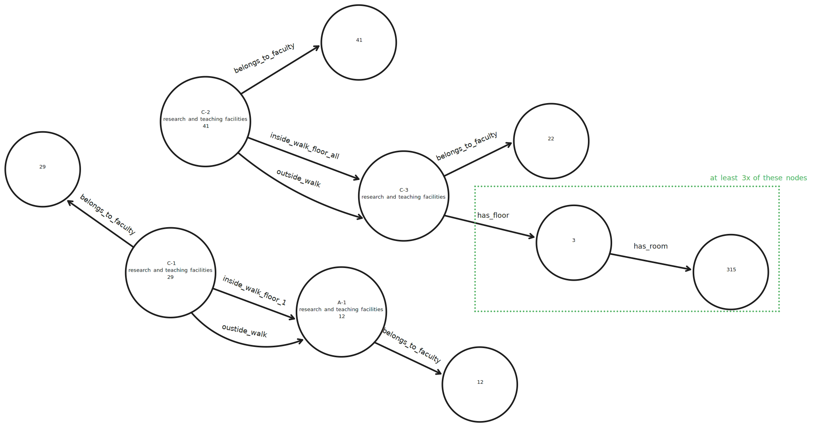

# Import data from AGH

We need to import data from [AGH map](https://www.agh.edu.pl/en/o-agh/kontakt/mapa-agh#&gid=lightbox-group-1816&pid=0)

Buildings we need data from especially:
S-1, S-2, D-1, U-2, A-4, A-3, C-4, C-3, C-2, U-1, H-A2, H-A1, A-2, A-1, C-1,A-0, B-1, B-2, B-3, B-4, H-B3B4, H-B1B2

## Requirements

Buildings: S-1, S-2, D-1, U-2, A-4, A-3, C-4, C-3, C-2, U-1, H-A2, H-A1, A-2, A-1, C-1,A-0, B-1, B-2, B-3, B-4, H-B3B4, H-B1B2, as nodes with property containing name,
building functions: service, research/teaching, use labels,
information about the neighborhood of buildings: e.g. C-3 is adjacent to C-2, there is a passageway on each floor; take into account that passageways do not occur on all floors, e.g. C-1 and A-1 are connected by a passageway only on the 1st floor, use edges with a property representing the floor number,
seats of departments and units (labeled with numbers on the map), use separate nodes to represent the seats,
halls where you had classes; room numbers and their relationship to buildings, at least three (how do you model them?),
entrances to buildings, you can assume that entrances are always on the first floor and are to have connections to all other entrances, so that it is clear that you can get from one building to another.

I propose the following model (will try to insert that into db)

## AGH Map

## Model schema

