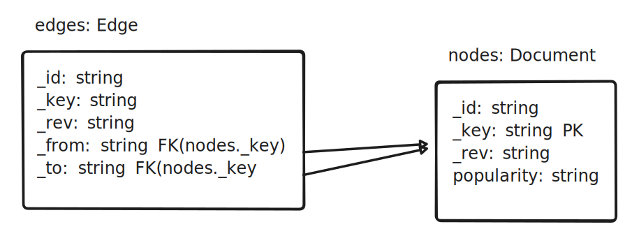

# Projekt - zaawansowane technologie bazodanowe

`as I am alone in my project, I need to accomplish 7-16 task only.`

## Wybór technologii

Wybór padł na ArangoDB.

### Licencja

[Arangodb](https://arangodb.com/) jest rozpowszechniane od [niedawna](https://arangodb.com/2024/02/update-evolving-arangodbs-licensing-model-for-a-sustainable-future/)* na licencji BSL 1.1 (Business Source License 1.1) Która zezwala na:

- kopiowanie,
- modyfikację,
- redystrybucję,
- użycie niekomercyjne i komercyjne w kontekście nieprodukcyjnym.

[Dokument licencji](https://github.com/arangodb/arangodb/blob/devel/LICENSE)

[Kod źródłowy ArangoDB](https://github.com/arangodb/arangodb)

\* Poprzednio była to licencja Apache 2.0

## Architektura: komponenty i interakcje, schemat (opcjonalny)

### Schemat bazy danych



Do bazy zostało zaimportowane:

- 5,483,248 krawędzi (dane pochodzą z pilku `taxonomy_iw.csv`)
- 951,821 wierzchołków (dane pochodzą z pliku `popularity_iw.csv`)

Przykładowy dokument:

```json
{
    "_id": "nodes/%22Weird_Al%22_Yankovic",
    "_key": "%22Weird_Al%22_Yankovic",
    "_rev": "_irOxdnC-OR",
    "popularity": "5767"
}
```

Przykładowa krawędź:

```json
{
    "_from": "nodes/Socialism_in_Burundi",
    "_id": "edges/10000000",
    "_key": "10000000",
    "_rev": "_irOxy-2-CU",
    "_to": "nodes/Communism_in_Burundi"
}
```

## Wymagania i zale»no±ci (mo duªy oprogramowania, bazy danych itp.)

## Instrukcje instalacji i konguracji

## Instrukcja obsªugi (jak uruchomi¢ program)

## □Pro ces pro jektowania i wdra»ania krok p o kroku

## Role wszystkich osób w pro jekcie i opis tego, kto co zrobiª

## Wyniki

## Instrukcja krok p o kroku jak o dtworzy¢ wyniki

## Samo o cena: nale»y omówi¢ efektywno±¢

## Strategie przyszªego ªago dzenia zidentykowanych niedo ci¡ gni¦¢
