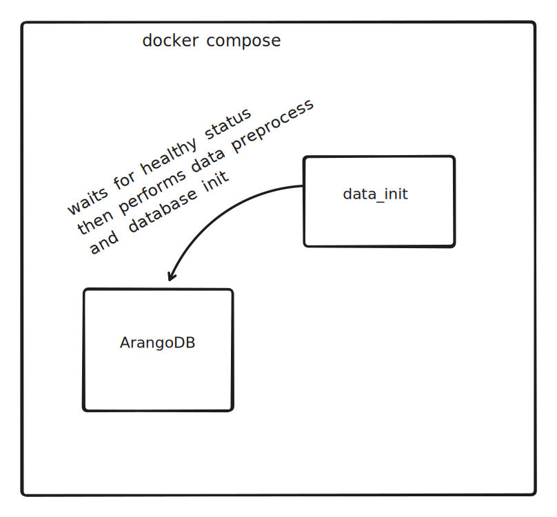
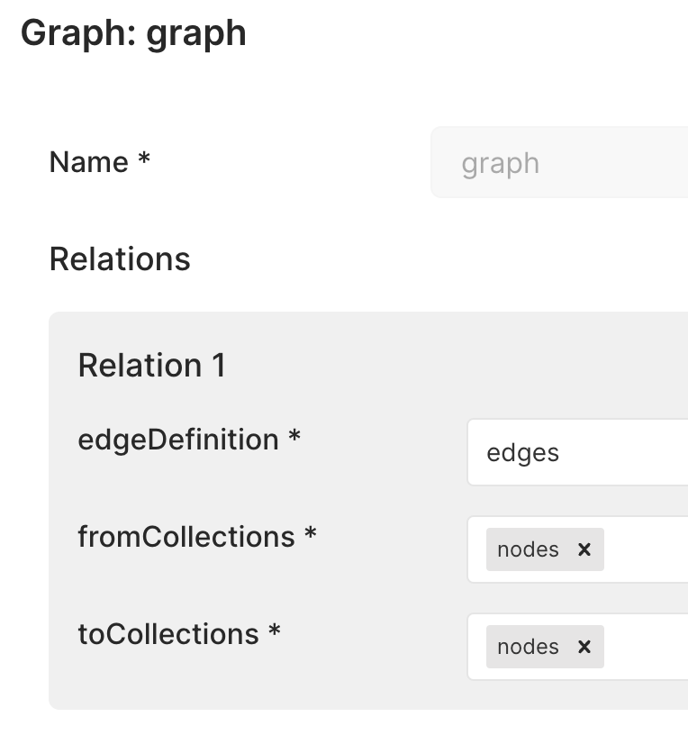

# Projekt - zaawansowane technologie bazodanowe

## Wybór technologii

Wybór padł na ArangoDB.

### Licencja

[Arangodb](https://arangodb.com/) jest rozpowszechniane od [niedawna](https://arangodb.com/2024/02/update-evolving-arangodbs-licensing-model-for-a-sustainable-future/)* na licencji BSL 1.1 (Business Source License 1.1) Która zezwala na:

- kopiowanie,
- modyfikację,
- redystrybucję,

Zabronione jest używanie oprogramowania ArangoDB w celach sprzedawania usług SaaS opartych na ArangoDB. W każdym innym przypadku użycie komercyjne jest dozwolone.

Dodatkowo ArangoDB Community Edition (zestaw narzędzi rozszerzających ArangoDB) ograniczone jest do 100GB rozmiaru datasetu w obszarze jednego klastra do celów komercyjnych.

\* Poprzednio była to licencja Apache 2.0. Która ma wrócić po 4 latach, jak opisano na blogu.

[Dokument licencji](https://github.com/arangodb/arangodb/blob/devel/LICENSE)

[Kod źródłowy ArangoDB](https://github.com/arangodb/arangodb)

## Architektura: komponenty i interakcje, schemat (opcjonalny)

### Schemat systemu (docker)



### Schemat bazy danych

#### Przykładowa krawędź

```json
{
  "_from": "nodes/1841_in_theatre",
  "_id": "edges/1000",
  "_key": "1000",
  "_rev": "_jH_CJCW-_R",
  "_to": "nodes/1841_plays"
}
```

#### Przykładowy wierzchołek

```json
{
  "_id": "nodes/%2Fpol%2F_phenomena",
  "_key": "%2Fpol%2F_phenomena",
  "_rev": "_jH-8E1O-Ks",
  "popularity": "15709",
  "title": "%2Fpol%2F_phenomena"
}

```

#### Graf i relacje (node -> node)



## Wymagania i zależnosci (moduły oprogramowania, bazy danych itp.)

### Przy użyciu Dockera

- Docker
- docker compose
- obraz Dockera arango:latest

### Bez Dockera

- Python 3.10
  - pakiet python-arango  
- arangodb (opcjonalnie community edition)

## Instrukcje instalacji i konguracji

Upewnijmy się że posiadamy `docker compose`.

```bash
docker compose version
```

Do repozytorium został załączony plik `docker-compose.yaml` dzięki któremu za pomocą

```bash
docker compose up # opcjonalnie -d (detached)
```

 uruchomimy bazę danych wraz z preprocessingiem i importem danych. Zalecam uruchomienie bez flagi `detached` ze względu na długo trwający (7 minut) import danych. Ewentualnie możemy sprawdzać logi i obserwować progres `docker compose logs`.

## Instrukcja obsługi (jak uruchomić program)

Upewnijmy się że posiadamy `docker compose`

```bash
docker compose up
```

Należy poczekać na import danych. W logach powinnismy ujrzeć

```plaintext
data_init  |
data_init  | created:          5483248
data_init  | warnings/errors:  288361
data_init  | updated/replaced: 0
data_init  | ignored:          0
data_init  | lines read:       5771611
data_init exited with code 0
```

Następnie by wejsć do kontenera z bazą danych

```
docker exec -it arangodb sh
```

Znajdziemy się w katalogu `/app`, w którym znajduje się `dbcli`, z którego możemy skorzystać do zapytań

```bash
ls -l
total 36
drwxr-xr-x    1 root     root           222 Jan 22 22:58 data
-rwxr-xr-x    1 root     root         12673 Jan 22 22:20 dbcli
-rw-r--r--    1 root     root         12649 Jan 22 22:15 dbcli.py
-rw-r--r--    1 root     root            32 Jan 22 22:58 test_installation.py
```

By wykonać polecenie należy odpowiednio

```bash
./dbcli 15 Microeconomics Service_companies
Total unique nodes across all paths: 13
```

Lista zalecanych argumentów na dole dokumentu.

## Proces projektowania i wdrażania krok po kroku

### Preprocessing

Na początku przejrzałem dane. Chciałem z nich wyodrębnić te poprawne, a te złe naprawić. Do tego użyłem narzędzia `grep`. Przykładowe testy:

```bash
# Every entry in taxonomy is of format `"\".*\",\".*\""`
> egrep "\".*\",\".*\"" ./data/taxonomy_iw.csv | wc -l
 5771611
> cat ./data/taxonomy_iw.csv | wc -l
 5771611
```

```bash
# Some records are broken
> egrep "\".*\",[0-9]+" ./data/popularity_iw.csv | wc -l
  915024

> cat ./data/popularity_iw.csv | wc -l
  952453

# View broken records
> egrep "\".*\",[0-9]+" ./data/popularity_iw.csv -v | head 5
```

```bash
# check for non terminated quotes, example:
grep -v "\"[^\"]*\"," ./data/popularity_iw.csv | wc -l 
# Popularity -> 37 167

# check for non escaped quotes inside first col
grep "\"[^\"]*\"[^\",]*\"" ./data/popularity_iw.csv | wc -l
# Popularity -> 21

# check for comma inside quotes in first col
grep "\"[^\"]*,[^\"]*\"" ./data/popularity_iw.csv | wc -l

# check for wrongly placed commas, example:
grep "\"[^\"]*,[^\"]*," ./data/popularity_iw.csv | wc -l

# check for commas inside first col in taxonomy
grep "^\"[^\"]*,[^\"]*\"" ./data/taxonomy_iw.csv | wc -l
# Taxonomy -> 147332

# check for non escaped quotes inside first col in taxonomy
grep "^\"[^\"]*\"[^\",]*\"" ./data/taxonomy_iw.csv | wc -l
# Taxonomy -> 52
```

Na podstawie tych eksperymentów napisałem parser i oraz enkoder*, który umożliwia dostarczenie poprawnych danych do importu do bazy danych.

\* Klucz w ArangoDB nie może posiadać niektórych znaków - więcej informacji tutaj [https://docs.arangodb.com/3.11/concepts/data-structure/documents/](https://docs.arangodb.com/3.11/concepts/data-structure/documents/)

### Import danych

Do importu danych wykorzystuję narzędzia dostarczone razem z ArangoDB `arangosh` oraz `arangoimport`.

Przed importem muszę utworzyć potrzebną bazę, wraz z jej kolekcjami oraz stworzyć graf i odpowiednią relację.

```bash
arangosh --server.username root --server.password test123 --server.endpoint http://arangodb:8529 --javascript.execute /app/data/init.js
```

`init.js`

```js
    db._createDatabase("wlgs");
    db._useDatabase("wlgs");
    db._createDocumentCollection("nodes");
    db._createEdgeCollection("edges");
    var graph_module = require("@arangodb/general-graph");
    var graph = graph_module._create("graph");
    graph;

    graph._addVertexCollection("nodes");
    var rel = graph_module._relation("edges", ["nodes"], ["nodes"]);
    graph._extendEdgeDefinitions(rel);
```

Następnie po wykonaniu tych poleceń, baza gotowa jest otrzymywać dane.

```
arangoimport --collection nodes \
    --file "/app/data/nodes.csv" \
    --type csv \
    --server.database wlgs \
    --server.endpoint http://arangodb:8529 \
    --server.username root \
    --server.password test123 \
    --on-duplicate ignore \
    --overwrite false && \
arangoimport --collection edges \
  --file "/app/data/edges.csv" \
  --type csv \
  --server.database wlgs \
  --server.endpoint http://arangodb:8529 \
  --server.username root \
  --server.password test123 \
  --on-duplicate ignore \
  --overwrite false

echo "[INFO]: Import completed."
```

Ważnym elementem jest flaga `--on-duplicate ignore`, która znacznie ułatwia mi import ze względu na sposób tworzenia wierzchołków w preprocessingu.

### Programowanie zapytań (AQL)

Prototypowałem zapytania bezposrednio w interfejsie webowym, które oferuje ArangoDB Community Edition. Gdy byłem pewny poprawnosći ich działania - przepisywałem je do narzędzia `dbcli`, gdzie w większosći przypadków wystarczyło je wkleić jako string.

Przykład bindowania zmiennych w `python-arango`

```python
aql_query = """
FOR path
IN 1..99 OUTBOUND K_PATHS 
@start_vertex TO @end_vertex
GRAPH 'graph'
OPTIONS {
    uniqueVertices: 'path',
}
RETURN {
    vertices: (
        FOR vertex IN path.vertices
            RETURN {
                key: vertex._key,
                title: vertex.title
            }
    ),
    edges: LENGTH(path.edges),
    weight: path.weight
}
"""
cursor = db.aql.execute(
    aql_query,
    bind_vars={
        'start_vertex': f'nodes/{start_key}',
        'end_vertex': f'nodes/{end_key}',
    }
)
```

### `dbcli`

Funkcja główna `dbcli` jest bardzo prosta - przekazuje parametry przekazane przez CLI do odpowiednich funkcji wykonujących okreslone zapytanie.

```python
if __name__ == "__main__":
    if len(sys.argv) < 2:
        print("Usage: dbcli.py <task_id> [args...]")
        sys.exit(1)

    client = ArangoClient(hosts="http://localhost:8529")
    db = client.db("wlgs", username="root", password="test123")

    task_id = int(sys.argv[1])
    args = sys.argv[2:] if len(sys.argv) > 2 else None

    result = execute_task(db, task_id, args)
    print(result)
```

## Role wszystkich osób w projekcie i opis tego, kto co zrobił

- Mikołaj Wielgos (całosć)

## Wyniki

Preprocessing działa poprawnie, dane importują się do bazy poprawnie, zapytania również wydają się poprawne. Zatem jestem w stanie stwierdzić, że udało mi się zaimplementować poprawnie cały wymagany system.

To nad czym nie udało mi się uzyskać zachwalających rezultatów, to przede wszystkim multi-threading. Choć ArangoDB jest zoptymalizowane dosć dobrze i zapytania nie wykonują się tak długo, to na moim sprzęcie nie udało mi się korzystać z więcej niż 1 rdzenia logicznego w zapytaniach.

## Instrukcja krok po kroku jak odtworzyć wyniki

## Samoocena: należy omówić efektywnosć

## Strategie przyszłego łagodzenia zidentyfikowanych niedociągnięć

## Zalecane parametry dla narzędzia `dbcli`

```bash
./dbcli.py 7
./dbcli.py 8
./dbcli.py 9
./dbcli.py 10
./dbcli.py 11 
./dbcli.py 12 WeWork WeWork2 
./dbcli.py 13 WeWork 1
./dbcli.py 14 Microeconomics Service_companies
./dbcli.py 15 Microeconomics Service_companies
./dbcli.py 16 Microeconomics 5
```

Notatka: jako że byłem sam w grupie - pozwolono mi wykonać tylko zapytania 7-16.
